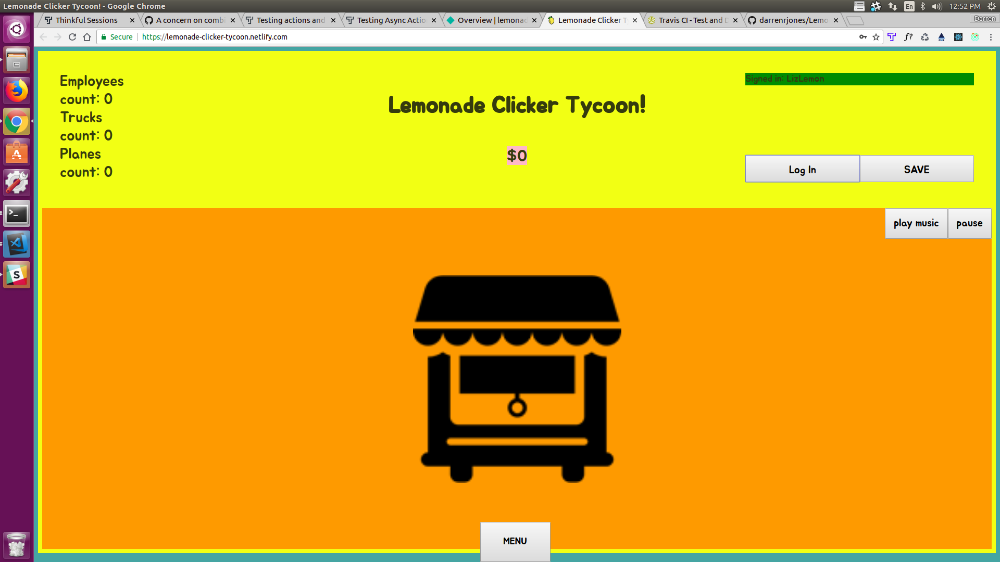
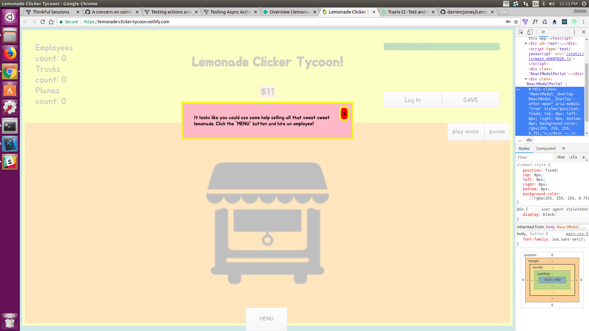
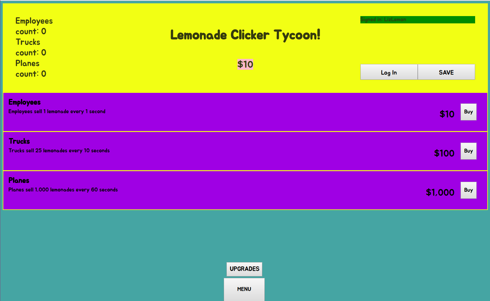
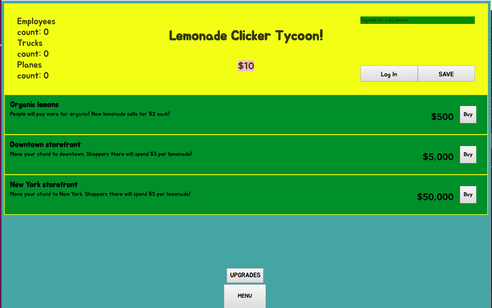
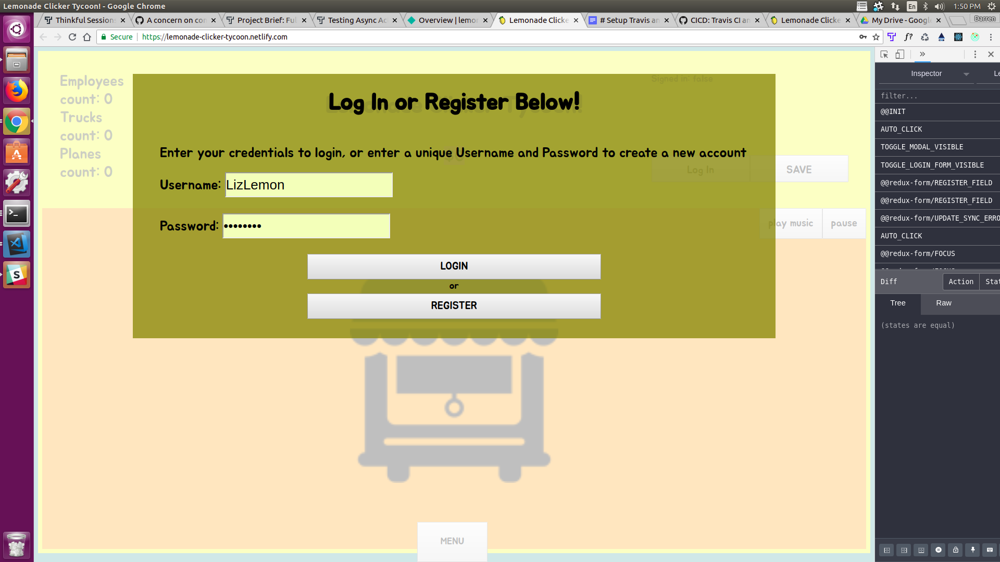

# Lemonade Clicker Tycoon

Welcome to Lemonade Clicker Tycoon. A casual clicker game where you click your way to riches by hiring employees and buying upgrades!

## Getting Started

Go here to play: [Lemonade Clicker Tycoon!](https://lemonade-clicker-tycoon.netlify.com/)

### Screenshots











## Built With

**React, React-Redux, Redux-Form, React-Modal**

**create-react-app** - deployed via Netlify

**Enzyme** for testing

**Node** - deployed via Heroku

**Express, Passport, Bcrypt, Mongoose, Chai, Mocha**

**Mongo** - hosted by Mlab

## Where key parts live in codebase:

All components, actions and reducers are in [**src**](https://github.com/darrenrjones/Lemonade-Clicker-Tycoon/tree/master/src) folder

```
project
│   README.md
│   [package.json](https://github.com/darrenrjones/Lemonade-Clicker-Tycoon/blob/master/package.json)           
│   
└───src
│   │   index.js
│   │   store.js
│   │   
│   │
│   └───[components](https://github.com/darrenrjones/Lemonade-Clicker-Tycoon/tree/master/src/components)
│       │   header
│       │   modal
│       │   playScreen
│       actions
│       │   file111.txt
│       │   file112.txt
│       │   ...
│       reducers
│       │   file111.txt
│       │   file112.txt
│       │   ...
│   
└───[public](https://github.com/darrenrjones/Lemonade-Clicker-Tycoon/tree/master/public)          
```

## Authors

* **Darren Jones** - [github](https://github.com/darrenrjones)

## License

This project is licensed under the MIT License - see the [LICENSE.md](LICENSE.md) file for details

## Acknowledgments

* Zach, Casey, Kevin and Chris for helping at many different stages


